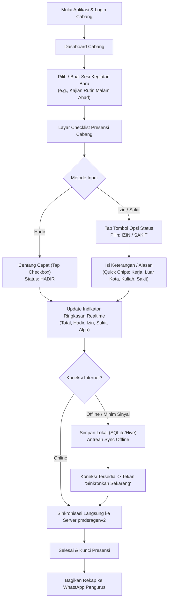

# AGENTS.md — Presensi PMD (Aplikasi Mobile Android Flutter)
**Sistem Terintegrasi Pendataan & Presensi Pemuda MTA Perwakilan Sragen**

- **Nama Resmi Aplikasi:** Presensi PMD
- **Package ID:** `id.or.mta.presensipmd`
- **Direktori Proyek:** `presensi_pmd`

Dokumen ini adalah cetak biru teknis (blueprint) dan pedoman standar perancangan untuk pengembangan **Aplikasi Mobile Android "Presensi PMD" berbasis Flutter** yang dikhususkan bagi **Sekretaris Cabang / Petugas Presensi Cabang**. Aplikasi ini terhubung langsung dengan backend dan database **`pmdsragenv2`** (`pmdsragen`).

---

## 1. Ringkasan & Tujuan Proyek

### 1.1 Latar Belakang
Pada sistem web **`pmdsragenv2`** (Laravel 12 + MariaDB/MySQL), data pemuda dari 70 cabang se-Kabupaten Sragen telah terdata dan terverifikasi secara terpusat. Namun, kegiatan rutin di tingkat cabang—seperti **Pengajian Rutin Pemuda/Pemudi (Gelombang)**, musyawarah cabang, dan kegiatan bakti dakwah—membutuhkan pencatatan presensi yang cepat, praktis, dan akurat di lapangan.

Pencatatan konvensional dengan kertas memiliki kelemahan:
- Rekapitulasi lambat dan rawan hilang/rusak.
- Tingkat keaktifan pemuda per cabang sulit dipantau pengurus wilayah dan kabupaten secara berkala.
- Keterangan izin/sakit sering tidak terdokumentasi rapi.

### 1.2 Solusi
Membangun aplikasi mobile Android ringan dengan **Flutter** yang dipegang oleh Sekretaris Cabang / Bagian Presensi untuk:
1. Membuka sesi presensi kegiatan rutin cabang secara instan.
2. Melakukan presensi dengan **mencentang (checklist)** anggota pemuda yang hadir.
3. Memberikan pilihan status kehadiran yang jelas: **Hadir**, **Izin** (dengan isian keterangan/alasan), **Sakit** (dengan keterangan), dan **Alpa** (belum hadir).
4. Menyediakan fitur **pencarian kilat (instant search)** dan **filter jenis kelamin (L/P)** agar pencatatan puluhan hingga ratusan pemuda selesai dalam hitungan menit.
5. Mendukung **Offline-First**: presensi tetap dapat dicatat di masjid/lokasi kegiatan meskipun sinyal internet lemah atau mati, kemudian disinkronkan (*sync*) otomatis saat online.
6. Menghasilkan rekapitulasi kehadiran instan yang siap dibagikan (*Share via WhatsApp*) ke pimpinan cabang dan pengurus perwakilan.

---

## 2. Aktor & Model Hak Akses

Aplikasi mobile ini dirancang khusus untuk level operasional cabang:

```text
[ Sistem Terpusat: pmdsragenv2 ]
               │
               ▼
┌──────────────────────────────────────────────────────────┐
│   Aktor: Sekretaris Cabang / Petugas Presensi Cabang    │
│   (Role: admin_cabang pada tabel users)                  │
└──────────────────────────────────────────────────────────┘
               │
               ├─► Terkunci pada cabang_id miliknya (Data-Scope Enforced)
               ├─► Hanya menampilkan pemuda aktif & terverifikasi di cabangnya
               ├─► Membuat & mengelola agenda/kegiatan presensi cabang
               └─► Menginput & menyinkronkan status kehadiran
```

### 2.1 Kebijakan Akses Data (Server-Side Isolation)
1. **Kredensial Pengguna**: Menggunakan username/email dan password dari tabel `users` yang sudah ada pada database `pmdsragen`.
2. **Kunci Cabang (`cabang_id`)**:
   - Setelah login, token autentikasi (Laravel Sanctum) membawa konteks `user_id` dan `cabang_id`.
   - Backend API wajib memvalidasi bahwa setiap operasi baca/tulis hanya boleh mengakses data pemuda dan kegiatan yang memiliki `cabang_id` sama dengan milik user yang sedang aktif.
   - Sekretaris Cabang A tidak dapat melihat atau mengubah presensi Cabang B.

---

## 3. Alur Kerja Presensi (Core User Flow)



### 3.1 Rincian Fitur Antarmuka Presensi:
1. **Header Statistik Realtime (Pinned Top)**:
   - Menampilkan total anggota, jumlah Hadir, Izin, Sakit, Alpa, serta persentase kehadiran (misal: *Kehadiran: 42/50 (84%)*).
2. **Filter & Navigasi Cepat**:
   - Tab Filter: **Semua** | **Laki-laki (Pemuda)** | **Perempuan (Pemudi)**.
   - Filter Status: Semua | Hadir Saja | Izin/Sakit | Belum Hadir.
   - **Kotak Pencarian Instan**: Mengetik nama anggota langsung menyaring daftar tanpa jeda/loading.
3. **Kartu Pemuda (List Tile)**:
   - Menampilkan: Foto Profil / Inisial Avatar, Nama Lengkap, Nomor Registrasi (NRP), Badge Status.
   - Tombol Toggle Centang Hijau untuk Hadir.
   - Tombol Aksi Titik Tiga / Menu Opsi: "Tandai Izin", "Tandai Sakit", "Batal / Reset".
4. **Modal/Bottom Sheet Keterangan Izin/Sakit**:
   - Jika dipilih status **Izin** atau **Sakit**, muncul bottom sheet responsif.
   - Kolom isian teks bebas untuk catatan detail.
   - Pilihan cepat (*Preset Chips*):
     - `Lembur / Shift Kerja`
     - `Tugas Belajar / Kuliah`
     - `Sedang di Luar Kota`
     - `Acara Keluarga`
     - `Kondisi Kurang Sehat / Sakit`

---

## 4. Desain Skema Database (`apppemudav2` / MySQL)

Untuk mendukung modul presensi tanpa mengubah integritas data master `pemuda`, ditambahkan 2 tabel baru di database `pmdsragen` via migration Laravel:

### 4.1 Tabel `kegiatan_presensi`
Menyimpan sesi pertemuan atau kegiatan yang diselenggarakan oleh cabang:

```sql
CREATE TABLE `kegiatan_presensi` (
  `id` INT UNSIGNED NOT NULL AUTO_INCREMENT,
  `cabang_id` INT UNSIGNED NOT NULL,
  `nama_kegiatan` VARCHAR(150) NOT NULL COMMENT 'Contoh: Pengajian Rutin Pemuda, Musyawarah Cabang',
  `tanggal` DATE NOT NULL,
  `jam_mulai` TIME NULL,
  `jam_selesai` TIME NULL,
  `lokasi` VARCHAR(200) NULL COMMENT 'Contoh: Masjid Al-Huda / Rumah Sdr. Fulan',
  `pemateri` VARCHAR(150) NULL COMMENT 'Nama Ustadz / Pembicara',
  `target_peserta` ENUM('semua', 'pemuda', 'pemudi') NOT NULL DEFAULT 'semua',
  `status` ENUM('draft', 'berlangsung', 'selesai') NOT NULL DEFAULT 'berlangsung',
  `catatan` TEXT NULL,
  `created_by` INT UNSIGNED NOT NULL COMMENT 'User ID sekretaris pembuat',
  `created_at` DATETIME NOT NULL DEFAULT CURRENT_TIMESTAMP,
  `updated_at` DATETIME NULL ON UPDATE CURRENT_TIMESTAMP,
  PRIMARY KEY (`id`),
  INDEX `idx_kegiatan_cabang_tanggal` (`cabang_id`, `tanggal`),
  INDEX `idx_kegiatan_status` (`status`),
  CONSTRAINT `fk_kegiatan_cabang` FOREIGN KEY (`cabang_id`) REFERENCES `cabang` (`id`) ON DELETE CASCADE,
  CONSTRAINT `fk_kegiatan_creator` FOREIGN KEY (`created_by`) REFERENCES `users` (`id`) ON DELETE RESTRICT
) ENGINE=InnoDB DEFAULT CHARSET=utf8mb4 COLLATE=utf8mb4_unicode_ci;
```

### 4.2 Tabel `presensi_detail`
Menyimpan data catatan kehadiran individu pemuda pada sesi kegiatan tertentu:

```sql
CREATE TABLE `presensi_detail` (
  `id` BIGINT UNSIGNED NOT NULL AUTO_INCREMENT,
  `kegiatan_presensi_id` INT UNSIGNED NOT NULL,
  `pemuda_id` INT UNSIGNED NOT NULL,
  `status_kehadiran` ENUM('hadir', 'izin', 'sakit', 'alpa') NOT NULL DEFAULT 'hadir',
  `keterangan` TEXT NULL COMMENT 'Alasan jika izin atau sakit',
  `waktu_presensi` DATETIME NULL COMMENT 'Waktu saat dicentang',
  `device_info` VARCHAR(100) NULL COMMENT 'Identitas device pencatat',
  `created_by` INT UNSIGNED NOT NULL,
  `created_at` DATETIME NOT NULL DEFAULT CURRENT_TIMESTAMP,
  `updated_at` DATETIME NULL ON UPDATE CURRENT_TIMESTAMP,
  PRIMARY KEY (`id`),
  UNIQUE KEY `uk_kegiatan_pemuda` (`kegiatan_presensi_id`, `pemuda_id`),
  INDEX `idx_presensi_status` (`status_kehadiran`),
  CONSTRAINT `fk_presensi_kegiatan` FOREIGN KEY (`kegiatan_presensi_id`) REFERENCES `kegiatan_presensi` (`id`) ON DELETE CASCADE,
  CONSTRAINT `fk_presensi_pemuda` FOREIGN KEY (`pemuda_id`) REFERENCES `pemuda` (`id`) ON DELETE CASCADE,
  CONSTRAINT `fk_presensi_user` FOREIGN KEY (`created_by`) REFERENCES `users` (`id`) ON DELETE RESTRICT
) ENGINE=InnoDB DEFAULT CHARSET=utf8mb4 COLLATE=utf8mb4_unicode_ci;
```

---

## 5. Spesifikasi REST API Backend (`pmdsragenv2`)

Komunikasi antara aplikasi mobile Flutter dan server Laravel 12 menggunakan protokol **REST API JSON** dengan autentikasi **Laravel Sanctum** (Bearer Token).

### 5.1 Format Standar Respon API

**Berhasil (200/201):**
```json
{
  "success": true,
  "message": "Data berhasil diproses.",
  "data": { ... },
  "meta": { "timestamp": "2026-09-21T05:00:00+07:00" }
}
```

**Gagal / Validasi Error (400/422/500):**
```json
{
  "success": false,
  "message": "Validasi gagal.",
  "errors": {
    "status_kehadiran": ["Status kehadiran tidak valid."]
  }
}
```

### 5.2 Daftar Endpoint REST API

| Method | Endpoint | Deskripsi | Otorisasi |
| :--- | :--- | :--- | :--- |
| `POST` | `/api/v1/auth/login` | Login sekretaris cabang (email/username + password) | Publik |
| `POST` | `/api/v1/auth/logout` | Revoke token aktif | Bearer Token |
| `GET` | `/api/v1/auth/me` | Ambil profil user & detail cabang yang dipegang | Bearer Token |
| `GET` | `/api/v1/cabang/pemuda` | Ambil seluruh pemuda aktif & terverifikasi di cabang | Bearer Token (Scope Cabang) |
| `GET` | `/api/v1/kegiatan` | Daftar sesi kegiatan presensi cabang | Bearer Token (Scope Cabang) |
| `POST` | `/api/v1/kegiatan` | Buat sesi kegiatan presensi baru | Bearer Token (Scope Cabang) |
| `GET` | `/api/v1/kegiatan/{id}` | Detail sesi kegiatan beserta daftar presensinya | Bearer Token (Scope Cabang) |
| `PUT` | `/api/v1/kegiatan/{id}/status` | Tutup / kunci sesi kegiatan (`selesai`) | Bearer Token (Scope Cabang) |
| `POST` | `/api/v1/kegiatan/{id}/presensi/single` | Simpan/ubah status presensi 1 pemuda realtime | Bearer Token (Scope Cabang) |
| `POST` | `/api/v1/kegiatan/{id}/presensi/bulk` | Simpan/sinkronkan presensi massal (Sync Batch) | Bearer Token (Scope Cabang) |
| `GET` | `/api/v1/kegiatan/{id}/rekap` | Ringkasan statistik & data teks rekap WA | Bearer Token (Scope Cabang) |

### 5.3 Contoh Payload Bulk Sync (`POST /api/v1/kegiatan/{id}/presensi/bulk`)
```json
{
  "device_info": "Samsung SM-A546B (Android 14)",
  "presensi_list": [
    {
      "pemuda_id": 142,
      "status_kehadiran": "hadir",
      "keterangan": null,
      "waktu_presensi": "2026-09-20 20:15:30"
    },
    {
      "pemuda_id": 158,
      "status_kehadiran": "izin",
      "keterangan": "Lembur shift malam di pabrik",
      "waktu_presensi": "2026-09-20 20:17:10"
    },
    {
      "pemuda_id": 204,
      "status_kehadiran": "sakit",
      "keterangan": "Demam tinggi",
      "waktu_presensi": "2026-09-20 20:18:00"
    }
  ]
}
```

---

## 6. Arsitektur Aplikasi Flutter

Aplikasi mobile dibangun dengan standar industri Flutter modern:

### 6.1 Spesifikasi Teknis
- **Nama Aplikasi:** Presensi PMD
- **Package ID / Bundle Identifier:** `id.or.mta.presensipmd`
- **Target Platform:** Android (minSdkVersion: 21 / Android 5.0, targetSdkVersion: 34 / Android 14)
- **Flutter SDK:** 3.47.2 / Stable
- **Dart SDK:** 3.13.2+
- **Pola Arsitektur:** *Feature-First Clean Architecture* (Data - Domain - Presentation)
- **State Management:** **Riverpod 2.x** (`flutter_riverpod` + `riverpod_annotation`)
- **HTTP Client:** **Dio** (dengan Auth Interceptor, auto-retry, dan standard error parser)
- **Local Storage (Offline-First):**
  - **Hive** / **Isar** / **sqflite** untuk cache data pemuda dan antrean sinkronisasi presensi.
  - **Flutter Secure Storage** / **SharedPreferences** untuk menyimpan Bearer Token & data sesi user.
- **UI Design System:** Material 3 dengan palet warna bernuansa hijau dakwah profesional (*Forest Green* `#1E5E3A`, *Mint Accent* `#38A169`, *Neutral Dark* `#1F2937`, *Neutral Light* `#F8FAFC`).

### 6.2 Struktur Direktori Proyek Flutter
```text
lib/
├── core/
│   ├── constants/            # App colors, styles, API URLs, asset paths
│   ├── network/              # Dio client, interceptors, error handling
│   ├── storage/              # Local database (Hive/sqflite) helper & secure storage
│   ├── utils/                # Date formatting (intl), string helpers, debouncer
│   └── widgets/              # Shared UI components (loading, buttons, custom app bar)
├── features/
│   ├── auth/                 # Login, session check, user profile
│   │   ├── data/             # Auth remote data source & repository
│   │   ├── domain/           # UserModel, login request/response
│   │   └── presentation/     # LoginScreen, auth controllers
│   ├── dashboard/            # Home dashboard cabang, summary info
│   ├── kegiatan/             # Kelola sesi agenda/kegiatan presensi
│   │   ├── data/
│   │   ├── domain/           # KegiatanModel
│   │   └── presentation/     # KegiatanListScreen, BuatKegiatanDialog
│   ├── presensi/             # Fitur inti checklist presensi
│   │   ├── data/             # PresensiRepository, sync offline service
│   │   ├── domain/           # PemudaModel, PresensiItemModel, RekapModel
│   │   └── presentation/
│   │       ├── screens/      # PresensiScreen, RekapPresensiScreen
│   │       ├── widgets/      # PemudaChecklistTile, IzinSakitBottomSheet, SummaryBar
│   │       └── controllers/  # PresensiNotifier, FilterNotifier, SearchNotifier
│   └── rekap/                # Rekapitulasi, export & share WhatsApp
└── main.dart                 # App initialization, ProviderScope, router
```

---

## 7. Penanganan Kasus Khusus di Lapangan (Field Edge Cases)

1. **Sinyal Lemah / Internet Mati di Masjid / Tempat Kegiatan**:
   - Seluruh daftar pemuda cabang telah di-*cache* saat pertama kali login atau saat membuka aplikasi sebelum berangkat ke kegiatan.
   - Sekretaris tetap dapat mencentang Hadir, Izin, atau Sakit secara offline tanpa jeda waktu.
   - Status presensi disimpan di database lokal ponsel bertanda flag `is_synced: false`.
   - Di layar muncul banner peringatan lembut: *"Mode Offline aktif. Data tersimpan di HP. Tekan Sinkronkan jika sudah mendapat sinyal."*
2. **Pencarian Cepat untuk Puluhan / Ratusan Pemuda**:
   - Menggunakan *in-memory filtering* di Flutter dengan *Debounce* 150ms sehingga pencarian berjalan 60 FPS tanpa lag.
3. **Pencegahan Data Hilang (Auto-Save)**:
   - Setiap kali checkbox disentuh, status langsung di-*commit* ke penyimpanan lokal seketika (tidak perlu menunggu menekan tombol Simpan di akhir).
4. **Format Laporan WhatsApp Otomatis**:
   - Tersedia tombol satu sentuhan: **"Bagikan Laporan ke WA"**.
   - Menghasilkan format teks rapi yang siap dikirim ke grup pengurus cabang:
     ```text
     *LAPORAN PRESENSI PEMUDA CABANG SRAGEN KOTA*
     Kegiatan: Pengajian Rutin Malam Ahad
     Hari/Tanggal: Ahad, 20 September 2026
     Tempat: Gedung Dakwah Cabang

     *REKAP KEHADIRAN:*
     - Total Pemuda: 60 orang
     - Hadir: 48 orang (80.0%)
     - Izin: 4 orang
     - Sakit: 2 orang
     - Alpa: 6 orang

     *DAFTAR IZIN:*
     1. Ahmad Fauzi (Lembur shift malam)
     2. Ridwan (Dinas luar kota)
     ...

     *DAFTAR SAKIT:*
     1. Danang (Demam)

     Pencatat: Sekretaris Cabang
     ```

---

## 8. Rencana Implementasi Bertahap (Roadmap)

### Tahap 1: Backend API & Database Migration (`pmdsragenv2`)
- [ ] Buat file migrasi database untuk tabel `kegiatan_presensi` dan `presensi_detail`.
- [ ] Buat Model Eloquent `KegiatanPresensi` dan `PresensiDetail` beserta relasinya ke `Cabang`, `Pemuda`, dan `User`.
- [ ] Konfigurasi route API `/api/v1/...` di Laravel 12.
- [ ] Buat Controller API (`Api/AuthController`, `Api/KegiatanController`, `Api/PresensiController`).
- [ ] Terapkan middleware otorisasi berbasis `cabang_id`.

### Tahap 2: Setup Proyek Flutter & Desain Dasar
- [ ] Inisialisasi struktur proyek Flutter (misal: `pmd_presensi_cabang`).
- [ ] Konfigurasi package `pubspec.yaml` (`flutter_riverpod`, `dio`, `hive`, `intl`, `share_plus`, dll.).
- [ ] Konfigurasi theming Material 3 (palet hijau dakwah MTA, tipografi, rounded shape).
- [ ] Setup network client `Dio` dengan interceptor token dan error handling.

### Tahap 3: Modul Autentikasi & Cache Data Master
- [ ] Layar Login sekretaris cabang dengan validasi form.
- [ ] Penyimpanan token dan profil cabang di storage aman.
- [ ] Pengambilan data pemuda cabang (`GET /api/v1/cabang/pemuda`) dan caching lokal menggunakan Hive.

### Tahap 4: Modul Kegiatan & Layar Presensi Inti
- [ ] Layar Dashboard Cabang & Pemilihan/Pembuatan Sesi Kegiatan.
- [ ] Komponen kartu pemuda dengan checkbox instan (Centang Hijau = Hadir).
- [ ] Dialog/Bottom sheet input alasan Izin & Sakit dengan quick chips.
- [ ] Filter tab (Semua / L / P / Status) dan search bar kilat.
- [ ] Header statistik ringkasan kehadiran realtime.

### Tahap 5: Sinkronisasi Offline & Rekapitulasi
- [ ] Logika antrean offline-sync (simpan lokal -> sync bulk saat online).
- [ ] Layar Rekap Presensi & Generator teks WhatsApp.
- [ ] Fitur Kunci / Tutup Sesi Presensi agar data final tidak berubah.

### Tahap 6: Pengujian Lapangan & Build APK
- [ ] Pengujian performa dengan dataset 100+ pemuda.
- [ ] Pengujian skenario offline (mode pesawat) dan reconnect.
- [ ] Build Android APK release (`flutter build apk --release`).

 #### Daftar Endpoint REST API (/api/v1): 
                                                                                                                                                   
   Method │ Endpoint                         │ Deskripsi                                                             │ Otorisasi
  ────────┼──────────────────────────────────┼───────────────────────────────────────────────────────────────────────┼─────────────────────────────
   GET    │ /api/v1/config                   │ Konfigurasi publik mobile (status online, versi minimum, pesan        │ Publik
          │                                  │ siaran, quick chips)                                                  │
   POST   │ /api/v1/auth/login               │ Login petugas cabang (email/username + password) menghasilkan Bearer  │ Publik
          │                                  │ Token                                                                 │
   POST   │ /api/v1/auth/logout              │ Revoke token aktif perangkat saat ini                                 │ Bearer Token
   GET    │ /api/v1/auth/me                  │ Ambil profil user login & detail cabang yang dipegang                 │ Bearer Token
   GET    │ /api/v1/cabang/pemuda            │ Ambil seluruh data pemuda cabang aktif untuk pencarian cepat & cache  │ Bearer Token (Scope Cabang)
          │                                  │ lokal Hive/SQLite                                                     │
   GET    │ /api/v1/kegiatan                 │ Daftar sesi kegiatan presensi cabang beserta ringkasan statistik      │ Bearer Token (Scope Cabang)
          │                                  │ kehadiran                                                             │
   POST   │ /api/v1/kegiatan                 │ Buat sesi kegiatan/pengajian presensi baru di cabang                  │ Bearer Token (Scope Cabang)
   GET    │ /api/v1/kegiatan/{id}            │ Detail sesi kegiatan beserta seluruh checklist anggota pemuda di      │ Bearer Token (Scope Cabang)
          │                                  │ cabangnya                                                             │
   PUT    │ /api/v1/kegiatan/{id}/status     │ Tutup / kunci sesi kegiatan presensi (selesai)                        │ Bearer Token (Scope Cabang)
   POST   │ /api/v1/kegiatan/{id}/presensi/s │ Simpan/ubah status presensi 1 orang pemuda secara realtime            │ Bearer Token (Scope Cabang)
          │ ingle                            │ (Hadir/Izin/Sakit/Alpa)                                               │
   POST   │ /api/v1/kegiatan/{id}/presensi/b │ Sinkronisasi massal antrean presensi offline ponsel (Bulk Sync Batch) │ Bearer Token (Scope Cabang)
          │ ulk                              │                                                                       │
   GET    │ /api/v1/kegiatan/{id}/rekap      │ Ringkasan statistik & data teks laporan siap kirim ke WhatsApp        │ Bearer Token (Scope Cabang)
          │                                  │ Pengurus                                                              │
                            
