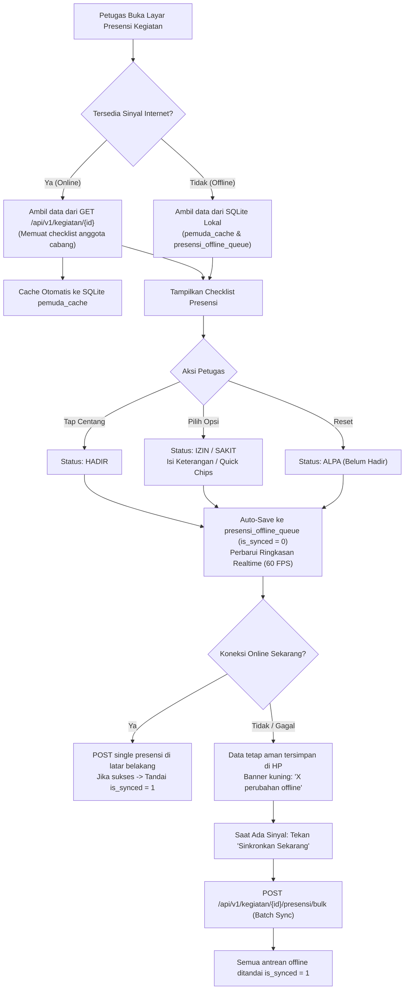

# Dokumentasi Teknis Pengembangan Aplikasi Mobile "Presensi PMD"
**Sistem Terintegrasi Pendataan & Presensi Pemuda MTA Perwakilan Sragen**

---

## 1. Ringkasan Proyek & Identitas Aplikasi

Aplikasi mobile Android **"Presensi PMD"** dirancang khusus untuk operasional cabang (Sekretaris Cabang / Petugas Presensi) guna mencatat kehadiran anggota pemuda/pemudi pada kegiatan pengajian rutin (gelombang), musyawarah cabang, dan kegiatan dakwah lainnya secara cepat, akurat, dan mendukung **Offline-First**.

### 1.1 Spesifikasi Teknis
- **Nama Aplikasi:** Presensi PMD
- **Package ID / Application ID:** `id.or.mta.presensipmd`
- **Target Platform:** Android (minSdkVersion: 21 / Android 5.0, targetSdkVersion: 34 / Android 14)
- **Flutter SDK:** 3.47.2 (Stable)
- **Dart SDK:** 3.13.2+
- **State Management:** Riverpod 2.6.1 (`flutter_riverpod`)
- **HTTP Client:** Dio 5.11.1 (dengan Interceptor Auth Sanctum, Timeout 60s, Auto-Retry)
- **Local Storage (Offline-First):** SQLite via `sqflite` + `shared_preferences`
- **Sharing & Ekspor:** `share_plus` (WhatsApp Sharing), `intl` (Format Tanggal Indonesia)
- **Base API URL:** `https://pemudamtasragen.my.id/api/v1`

---

## 2. Arsitektur Proyek (*Feature-First Clean Architecture*)

Struktur proyek disusun secara modular berbasis fitur (*feature-first*) agar mudah dipelihara dan dikembangkan:

```text
presensi_pmd/
├── android/                  # Konfigurasi Gradle Android (Namespace: id.or.mta.presensipmd)
├── lib/
│   ├── core/
│   │   ├── constants/        # AppColors (Material 3 Hijau Dakwah), ApiEndpoints
│   │   ├── network/          # ApiClient (Dio, Timeout, Error Parser, Auto-Retry)
│   │   │                     # ConnectivityService (Pemantau status jaringan online/offline)
│   │   ├── providers/        # Core Riverpod Providers (Dependency Injection)
│   │   ├── storage/          # DatabaseHelper (SQLite Caching & Offline Queue)
│   │   │                     # PreferencesHelper (Bearer Token, Session, Quick Chips)
│   │   ├── utils/            # DateFormatter (Format Indo), DeviceUtil (Identitas Perangkat)
│   │   └── widgets/          # Reusable UI: CustomButton, CustomTextField, AppBadge, EmptyState
│   ├── features/
│   │   ├── auth/             # Modul Otentikasi
│   │   │   ├── data/         # AuthRepository
│   │   │   ├── domain/       # UserModel, CabangModel
│   │   │   └── presentation/ # LoginScreen, AuthController
│   │   ├── dashboard/        # Modul Beranda Cabang
│   │   │   └── presentation/ # DashboardScreen (Filter Sesi, Card Kegiatan, Cache Pemuda)
│   │   ├── kegiatan/         # Modul Manajemen Sesi Kegiatan Presensi
│   │   │   ├── data/         # KegiatanRepository
│   │   │   ├── domain/       # KegiatanModel
│   │   │   └── presentation/ # KegiatanController, BuatKegiatanDialog
│   │   └── presensi/         # Modul Inti Presensi & Rekapitulasi
│   │       ├── data/         # PresensiRepository (Logika Checklist & Offline Sync)
│   │       ├── domain/       # PemudaModel, PresensiItemModel, RekapModel
│   │       └── presentation/
│   │           ├── controllers/ # PresensiController (In-Memory Search & Filtering)
│   │           ├── screens/     # PresensiScreen, RekapPresensiScreen
│   │           └── widgets/     # PemudaChecklistTile, IzinSakitBottomSheet, SummaryBar
│   ├── app.dart              # Konfigurasi Tema Material 3 & Root Routing
│   └── main.dart             # Inisialisasi Storage, SQLite, dan ProviderScope
├── test/
│   └── widget_test.dart      # Unit Testing (PemudaModel, PresensiItemModel, RekapGenerator)
└── presensi-pmd-v1.0.0.apk   # File APK Android Release siap pasang
```

---

## 3. Alur Kerja Offline-First & Penyimpanan Lokal (SQLite)

Untuk mengatasi kendala sinyal internet yang lemah atau mati di lokasi kegiatan (masjid/gedung cabang), aplikasi menerapkan mekanisme **Offline-First** berbasis SQLite:



### 3.1 Skema Tabel Database Lokal Ponsel (`DatabaseHelper`)
1. **`pemuda_cache`**: Menyimpan master data seluruh anggota pemuda cabang agar daftar presensi dapat langsung dibuka tanpa loading jaringan.
2. **`kegiatan_cache`**: Menyimpan daftar riwayat sesi kegiatan presensi cabang.
3. **`presensi_offline_queue`**: Antrean catatan kehadiran per pemuda per kegiatan dengan kolom `is_synced` (0/1), `keterangan`, `waktu_presensi`, dan `device_info`.

---

## 4. Analisis Masalah Jaringan & Solusi Implementasi

### 4.1 Permasalahan Awal di Lapangan
1. **Timeout pada Login (`POST /api/v1/auth/login`):**
   - Server backend membutuhkan waktu pemrosesan antara **20 hingga 25 detik** untuk mengeksekusi login dan menerbitkan Bearer Token Sanctum.
   - Konfigurasi timeout default aplikasi awalnya berada di 15 detik, mengakibatkan kegagalan koneksi (*connection timeout/receive timeout*).
2. **Endpoint `/api/v1/cabang/pemuda` Mengalami Kendala di Server:**
   - Pemanggilan `GET /api/v1/cabang/pemuda` memakan waktu > 2 menit hingga Cloudflare memutus koneksi (*Gateway Timeout*).
   - Pemuatan awal checklist yang bergantung pada endpoint ini membuat aplikasi tampak macet (*stuck*).
3. **Penyelesaian DNS IPv6:**
   - Domain server mengembalikan alamat IPv6 dan IPv4 dari Cloudflare. Pada jaringan tanpa routing IPv6, terjadi jeda 10-15 detik sebelum *fallback* ke IPv4.

### 4.2 Solusi Teknis yang Diterapkan
1. **Peningkatan Timeout Dio Menjadi 60 Detik:**
   - Menjamin bahwa proses login server (~22s) berhasil diselesaikan tanpa pemutusan koneksi prematur.
2. **Mekanisme Auto-Retry Otomatis:**
   - Menambahkan interceptor pada Dio yang secara otomatis mencoba ulang (*retry*) hingga 2 kali saat terjadi gangguan sementara atau *handshake timeout*.
3. **Optimasi Alur Pemuatan Presensi (Direct Checklist Extraction):**
   - Endpoint detail kegiatan `GET /api/v1/kegiatan/{id}` terbukti sangat responsif (**2.8 detik**) dan sudah menyertakan seluruh data anggota pada array `data.checklist`.
   - Aplikasi dialihkan untuk langsung memanfaatkan data ini dan meng-*cache*-nya ke SQLite ponsel, sehingga tidak lagi bergantung pada endpoint `/api/v1/cabang/pemuda`.
4. **Proteksi Timeout 8 Detik:**
   - Tombol manual *"Cache Data Pemuda Cabang"* di dashboard diberi batasan timeout 8 detik dengan *fallback* instan ke SQLite agar antarmuka tidak membeku (*non-blocking*).

---

## 5. Ringkasan Endpoint REST API Backend Terintegrasi

| Method | Endpoint | Fungsi | Status & Kecepatan |
| :--- | :--- | :--- | :--- |
| `GET` | `/api/v1/config` | Konfigurasi global & Quick Chips | Terhubung (~1.2s) |
| `POST` | `/api/v1/auth/login` | Login petugas cabang (Email/Username + Password) | Terhubung (~22s) |
| `GET` | `/api/v1/auth/me` | Profil petugas & info cabang | Terhubung (~22s) |
| `GET` | `/api/v1/kegiatan` | Daftar sesi kegiatan presensi cabang | Terhubung (~1.9s) |
| `POST` | `/api/v1/kegiatan` | Buka sesi presensi kegiatan baru | Terhubung |
| `GET` | `/api/v1/kegiatan/{id}` | Detail kegiatan & seluruh checklist anggota pemuda | Terhubung (~2.8s) |
| `POST` | `/api/v1/kegiatan/{id}/presensi/single` | Simpan kehadiran 1 orang pemuda realtime | Terhubung (**0.58s**) |
| `POST` | `/api/v1/kegiatan/{id}/presensi/bulk` | Sinkronisasi massal antrean offline ponsel | Terhubung (**0.59s**) |
| `GET` | `/api/v1/kegiatan/{id}/rekap` | Statistik & teks laporan siap kirim ke WhatsApp | Terhubung (**0.61s**) |
| `PUT` | `/api/v1/kegiatan/{id}/status` | Kunci / selesaikan sesi kegiatan | Terhubung |

---

## 6. Fitur Utama Antarmuka Aplikasi

1. **Layar Login Petugas Cabang:**
   - Validasi formulir, tombol tampilkan/sembunyikan kata sandi, dan penyimpanan token sesi otomatis.
2. **Dashboard Cabang:**
   - Menampilkan salam personal, nama cabang, dan banner status mode *Offline-First*.
   - Filter tab kegiatan: **Semua**, **Aktif (Berlangsung)**, dan **Selesai**.
   - Kartu kegiatan dengan ringkasan kehadiran instan (Hadir, Izin, Sakit).
   - Tombol Floating Action *"Buka Sesi Baru"* dengan dialog isian lengkap (Nama, Tanggal, Jam, Lokasi, Pemateri, Target Peserta, Catatan).
3. **Layar Checklist Presensi Inti:**
   - **Header Statistik Realtime (Pinned Top):** Total anggota, jumlah Hadir, Izin, Sakit, Alpa, dan persentase kehadiran lengkap dengan progress bar visual.
   - **Banner Indikator Offline:** Menampilkan jumlah rekaman data yang tersimpan di HP dan belum tersinkron ke server dengan tombol satu sentuhan *"Sinkronkan"*.
   - **Pencarian Kilat (Instant Search):** Penyaringan nama/NRP *in-memory* tanpa jeda/loading (60 FPS).
   - **Filter Segmented:** Tab filter jenis kelamin (Semua / Pemuda (L) / Pemudi (P)) dan filter status (Hadir, Izin/Sakit, Belum Hadir).
   - **Centang Cepat (Tap Checkbox):** Menandai langsung status Hadir.
   - **Modal Bottom Sheet Izin & Sakit:** Pilihan alasan cepat (*quick preset chips*: *Lembur / Shift Kerja*, *Tugas Belajar / Kuliah*, *Sedang di Luar Kota*, *Acara Keluarga*, *Kondisi Kurang Sehat / Sakit*, *Urusan Mendesak*) serta isian teks bebas.
4. **Layar Rekapitulasi & Berbagi WhatsApp:**
   - Kartu statistik kehadiran final.
   - Daftar rincian pemuda izin dan sakit beserta alasannya.
   - Kotak pratinjau format teks laporan rapi sesuai standar perwakilan.
   - Tombol **"Bagikan Laporan ke WhatsApp"** (`share_plus`) dan tombol **"Kunci & Selesaikan Kegiatan"**.

---

## 7. Hasil Pengujian & File Rilis APK

1. **Analisis Statis (`flutter analyze`):**
   ```text
   Analyzing presensi_pmd...
   No issues found!
   ```
2. **Pengujian Unit (`flutter test`):**
   ```text
   00:00 +0: Presensi PMD Unit Tests PemudaModel parsing and initials
   00:00 +1: Presensi PMD Unit Tests PresensiItemModel status toggle and copyWith
   00:00 +2: Presensi PMD Unit Tests RekapModel WhatsApp text generation
   00:00 +3: All tests passed!
   ```
3. **Hasil Build APK Release:**
   - File APK telah berhasil dikompilasi ke mode Release:
     - **File:** `presensi-pmd-v1.0.0.apk` (53 MB)
     - **Lokasi Utama:** `/home/kira/presensi_pmd/presensi-pmd-v1.0.0.apk`
     - **Lokasi Build Flutter:** `/home/kira/presensi_pmd/build/app/outputs/flutter-apk/app-release.apk`
4. **Kredensial Uji Coba Lapangan:**
   - **Username:** `jenar`
   - **Password:** `234234`
   - **Cabang Terkait:** Cabang Jenar (Wilayah 1)
